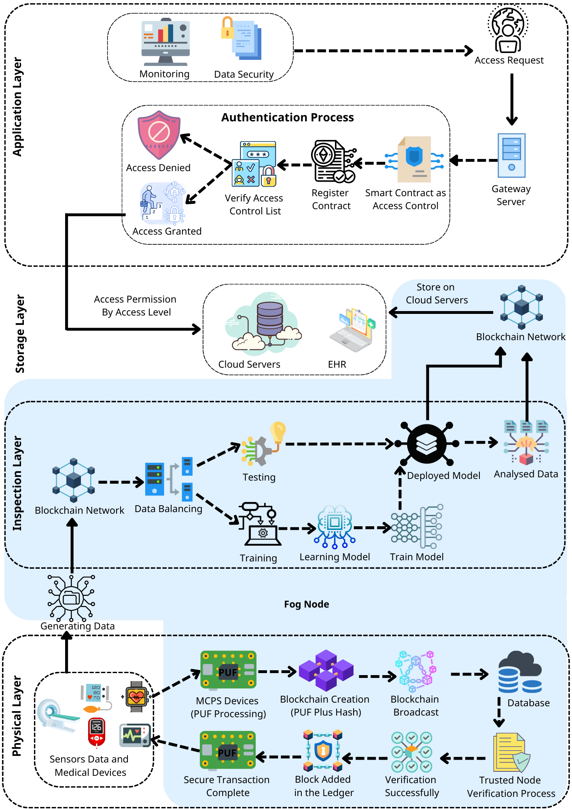

> 🎓 Academic Research Implementation • DOI Verified • AMCB Model (Published 2024 — Code Extended 2025)

# AMCB – Authenticated Medical Cyber-Physical Blockchain Model

This repository hosts the **official research-aligned codebase** for the **AMCB framework**, developed as part of an MSc thesis project and later **published in 2024**.  
The implementation was further extended in **2025** to map the research architecture directly to an executable multi-layer system.

> **Research Paper:**  
> *"AMCB: Authenticated Medical Cyber-Physical Blockchain Model"*  
> **Journal:** Multimedia Tools and Applications (Springer), Volume 83, pp. 89079–89109 (2024)  
> **DOI:** [10.1007/s11042-024-18950-1](https://doi.org/10.1007/s11042-024-18950-1)

---

## 🧠 Project Overview

AMCB proposes a **multi-layered security model** for authenticated medical cyber-physical systems (MCPS).  
The framework integrates **PUF-based physical authentication**, **blockchain-anchored identity**, **cloud storage resilience**, and **AI-driven inspection** to form an end-to-end trust chain between medical devices, users, and cloud infrastructure.

This repository provides the **practical mapping** of that model into modular components, each implemented as a standalone layer.

---

## 🧭 AMCB Layer Architecture (Research → Implementation)

| **Layer** | **Repository Folder** | **Conceptual Function** | **Implementation Description** |
|------------|----------------------|--------------------------|--------------------------------|
| 🧩 **Physical Layer** | `/physical-layer/` | Establishes hardware-rooted trust using PUFs | Implements a real logic-based PUF circuit producing 5 hardware keys verified via MAC + PUF pairing before blockchain registration |
| ⛓ **Blockchain Layer** | `/blockchain-layer/ethereum/` | Provides decentralized identity ledger | Solidity smart contract for secure on-chain registration of verified entities |
| ☁ **Storage Layer** | `/storage-layer/firebase/` | Ensures redundant data persistence | Firebase integration for off-chain encrypted record storage and synchronization |
| 🔍 **Inspection Layer** | `/inspection-layer/` | Performs AI/ML-based integrity validation | Includes five datasets and ML models evaluated to reproduce the paper’s experimental results |
| 💻 **Application Layer** | `/application-layer/` | User & access-control interface | DApp built with React / Next.js connecting blockchain events to Firebase storage |
| 🧪 **Deployment & Testing** | `/tests/` | Verifies functional integrity | Mocha / Chai scripts for smart-contract unit testing |

---

## 🧭 AMCB Architecture Diagram



---

## 📚 Citation

If you use this repository in academic work, please cite:

**IEEE Format**
> H. A. Al-Ghuraybi, *"AMCB: Authenticated Medical Cyber-Physical Blockchain Model,"* Multimedia Tools and Applications, vol. 83, pp. 89079–89109, 2024. DOI: 10.1007/s11042-024-18950-1.

**BibTeX**
```bibtex
@article{alghuraybi2024amcb,
  title     = {AMCB: Authenticated Medical Cyber-Physical Blockchain Model},
  author    = {Al-Ghuraybi, Hind A.},
  journal   = {Multimedia Tools and Applications},
  volume    = {83},
  pages     = {89079--89109},
  year      = {2024},
  publisher = {Springer},
  doi       = {10.1007/s11042-024-18950-1}
}
```

---

## ⚖ License

This repository is released under the **MIT License**.

- Original work © 2022 Lim Jason — *Blockchain Medical Records System*  
- Extended implementation © 2025 Hind Al-Ghuraybi — *AMCB Framework Adaptation*

---

### 🔎 Notes

- This repository represents a **research-grade, reproducible implementation** of the AMCB architecture.  
- Each sub-module (layer) includes its own execution guide, dataset references, and validation results as documented in the published paper.  
- For architectural diagrams and validation results, see the `/docs/` folder.

---

> © 2025 AMCB Research Implementation – “Turning Cyber-Physical Security Theory into Executable Trust Layers.”
